<p align="center">
  
</p>

<p align="center">
  <strong>Self-hosted AI chat for teams who prefer a coherent tool over a feature maze.</strong><br>
  One Bun process · SQLite · local attachments · resumable streaming
</p>

<p align="center">
  <a href="#see-it-work">See it work</a> ·
  <a href="#what-you-get">Capabilities</a> ·
  <a href="#quick-start">Quick start</a> ·
  <a href="#administration">Administration</a> ·
  <a href="#status">Status</a>
</p>

## See it work

Solar keeps research, source evidence, model choice, tools, and the next prompt
in one working surface. This example combines web and local-tool calls while
keeping its source trail attached to the reply.

<p align="center">
  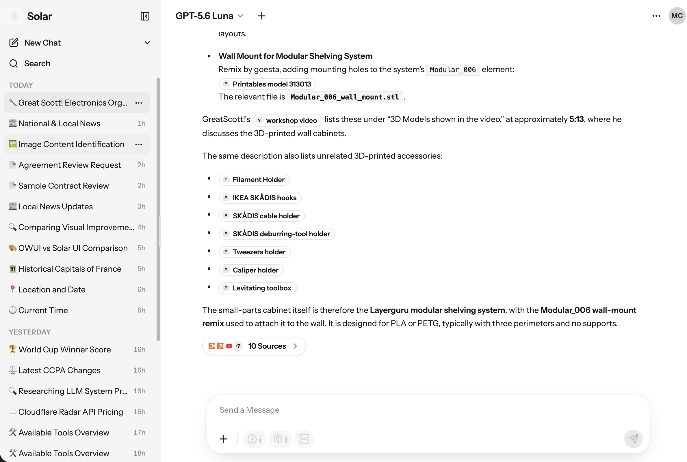
</p>

<p align="center">
  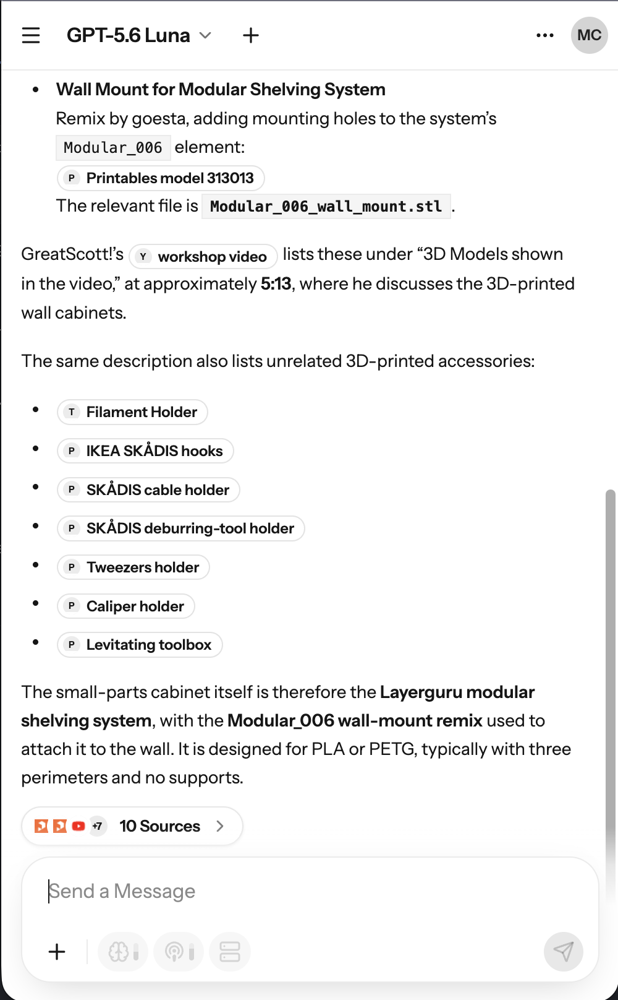
  &nbsp;&nbsp;
  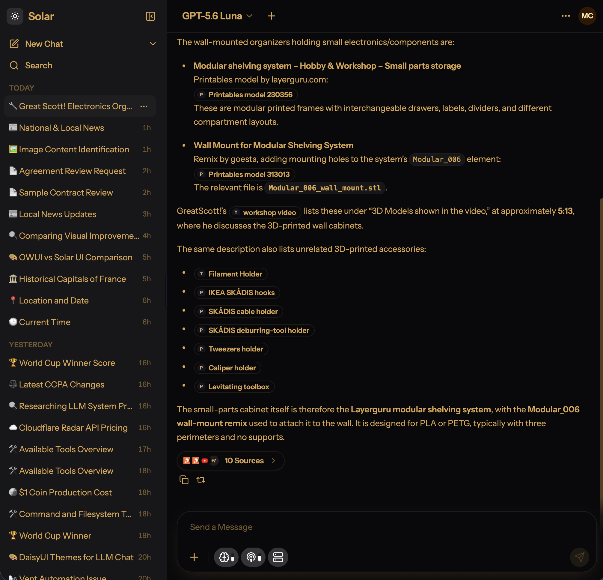
</p>

### Evidence stays with the answer

Source chips work inline and a compact source list collects the material behind
the response.

<p align="center">
  
</p>

### Set up the conversation, not just the prompt

Start from a reusable preset, choose a configured model, set answer detail, and
select the MCP servers that may run. The conversation menu makes its current
context window, compaction progress, and cost inspectable.

<p align="center">
  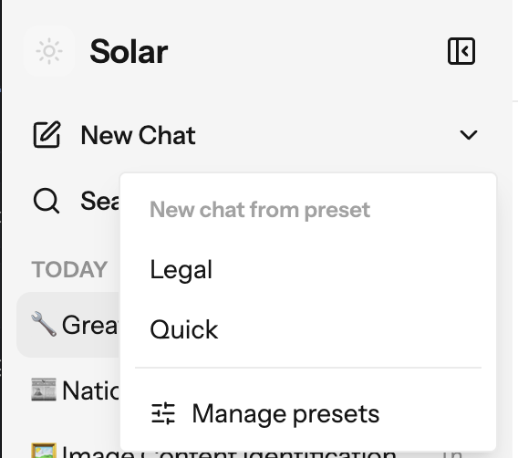
  &nbsp;
  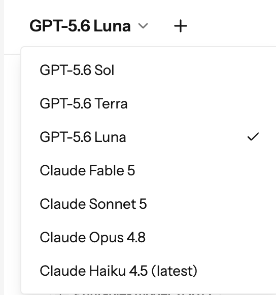
  &nbsp;
  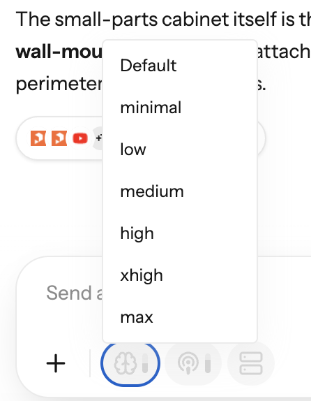
</p>

<p align="center">
  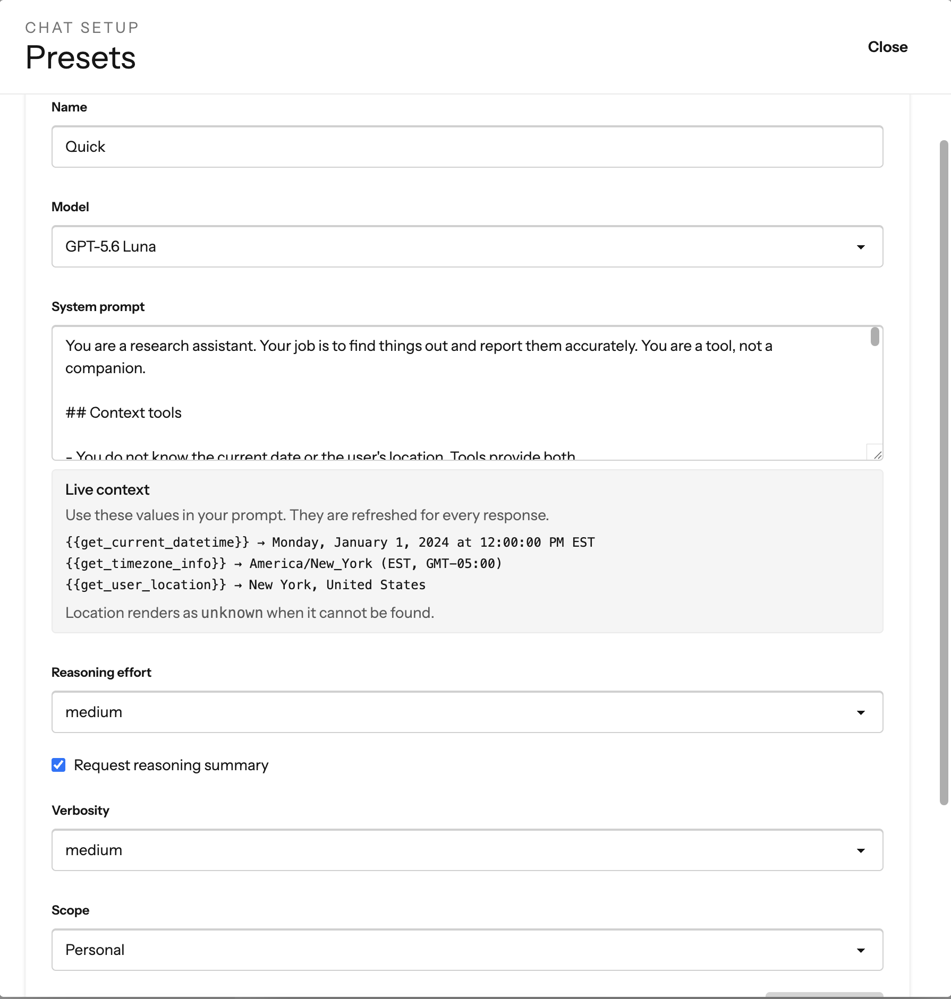
</p>

<p align="center">
  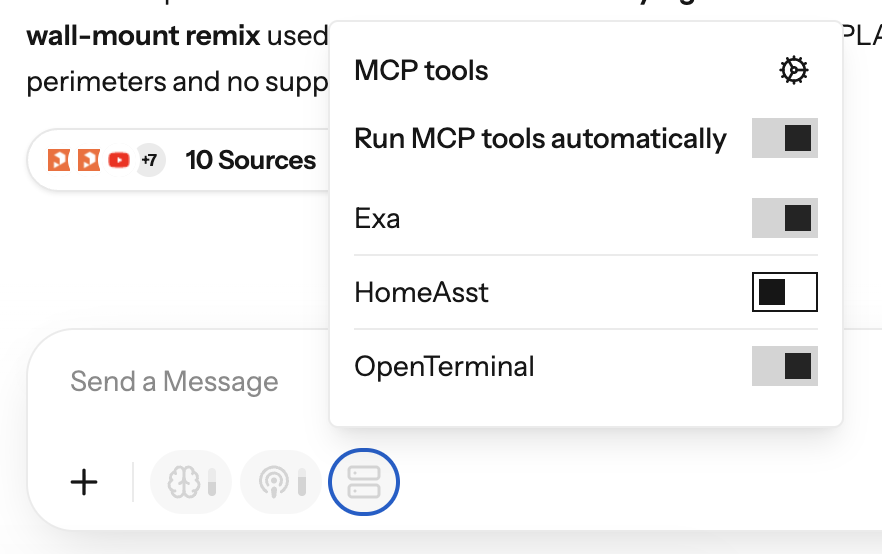
  &nbsp;
  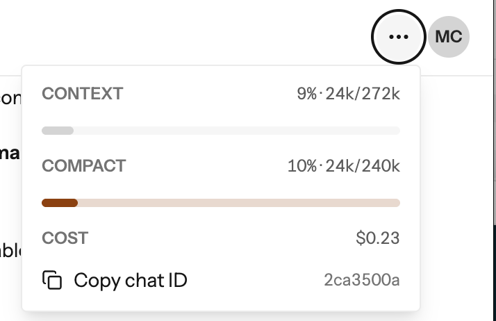
</p>

### Give the agent real work

Files become native model inputs where supported. Tool activity streams as part
of the answer, including built-in context tools and remote MCP servers; the
finished answer can cite the sources it used.

<p align="center">
  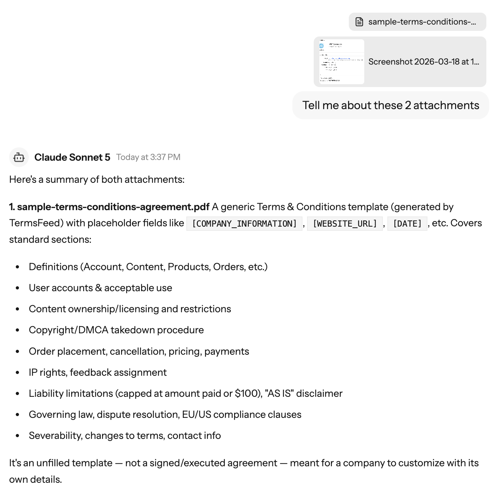
</p>

<p align="center">
  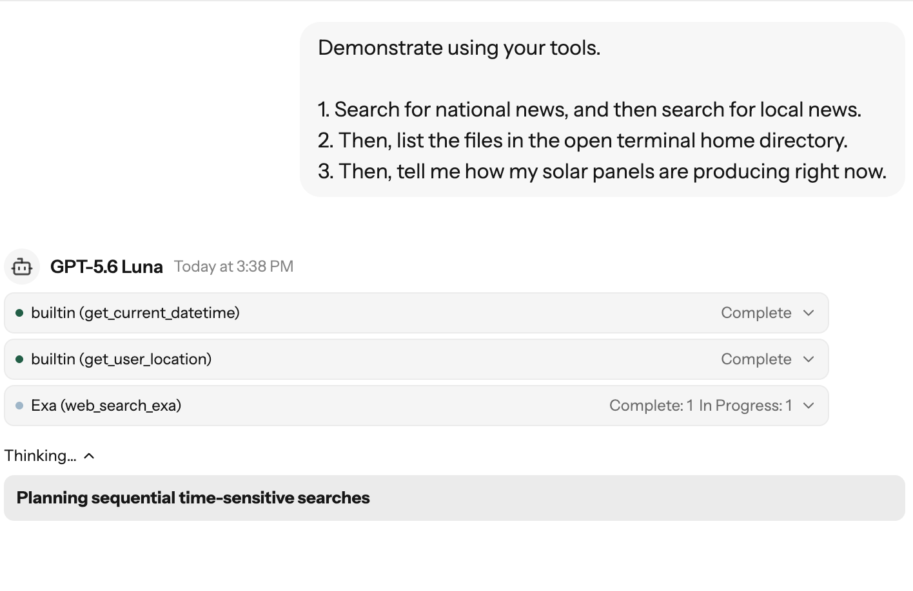
  &nbsp;
  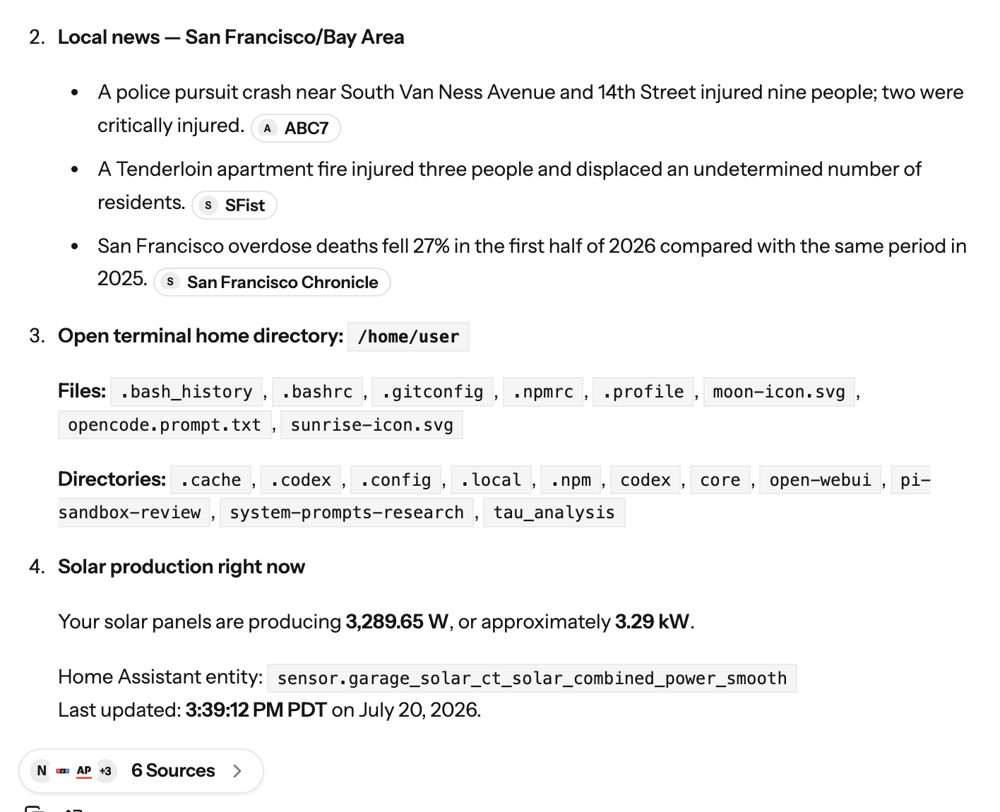
</p>

## What you get

- **Pi-powered, model-flexible chat.** `pi-agent-core` drives the agent loop and
  `pi-ai` provides a unified path across configured providers and model APIs.
  Switch models per conversation without rebuilding the workspace around one
  vendor.
- **First-class streamed parts.** Thinking, tool calls, Markdown, code, LaTeX,
  citations, and source lists arrive in the thread as they are produced.
- **Remote MCP tools.** Connect Streamable HTTP MCP servers, discover tools,
  prompts, and resources, and enable them globally, per user, or per
  conversation.
- **Context that manages itself.** Solar builds a bounded context from stable
  instructions, the first request, a structured rolling summary, and useful
  recent turns. Background compaction reduces old reasoning and bulky tool
  transactions before older history is summarized.
- **Files without a heavy RAG pipeline.** Images become provider-native vision
  inputs. Plain text and supported Office/PDF documents are extracted or passed
  through according to model capability—no embeddings or vector database
  required.
- **Persistent by default.** Conversations, native message parts, tool steps,
  summaries, usage, and attachments live in one SQLite database plus a local
  data directory. A dropped browser connection does not cancel generation;
  reload can bring it back.
- **Responsive and themed.** The sidebar becomes a drawer on narrow screens;
  themes persist automatically, with Solar Light and Solar Dark among the
  choices.
- **Lightweight deployment.** A single Bun/Hono process serves the API, SSE
  stream, and React build. No separate frontend host, queue, vector store, or
  services bundle is required.

## How it works

```text
browser
  │  typed tRPC + SSE UI Message Stream
  ▼
one Bun process ── Hono / tRPC / generation manager
  │       │             │
  │       │             └── pi-agent-core + pi-ai
  │       └──────────────── models, reasoning, MCP tools
  ├── React + assistant-ui
  ├── SQLite (auth, chats, native parts, context, usage)
  └── Mirage local disk (images, text, documents)
```

The generation task is decoupled from the HTTP request. It buffers deltas,
persists the final native assistant message, and lets SSE subscribers reconnect
with `Last-Event-ID`. Explicit **Stop** is the cancellation boundary.

## Quick start

### Docker Compose

```sh
cp .env.example .env
# Set BETTER_AUTH_SECRET to a strong value of at least 32 characters.
docker compose up --build
```

Open <http://localhost:3000>. Persistent database and attachment data live in
`./data`.

The first account registered on a fresh deployment becomes the admin. In local
development, the seeded convenience account is `admin@solar.local` with
password `password`.

### Bun development

```sh
bun install
bun run solar dev start
```

The managed server chooses a stable worktree-specific port in the `3000–3999`
range. Set `PASEO_PORT` to override it. Use `SOLAR_MOCK_LLM=1` to exercise the
full UI with a zero-cost local generator. On an empty development database, it
prints the seeded admin login and generated Development API key, which persists
with the database.

### Bun package (after publishing)

```sh
bunx @mcowger/solar
```

SQLite and attachments are created relative to the current directory by default.

## Administration

Solar puts the operational surface in the product: users and administrator API
keys; provider endpoints and imported models; model capabilities and context
policy; task-model and large-paste settings; and aggregated token usage.

<details>
<summary><strong>Users and API keys</strong></summary>
<br>
<p align="center">
  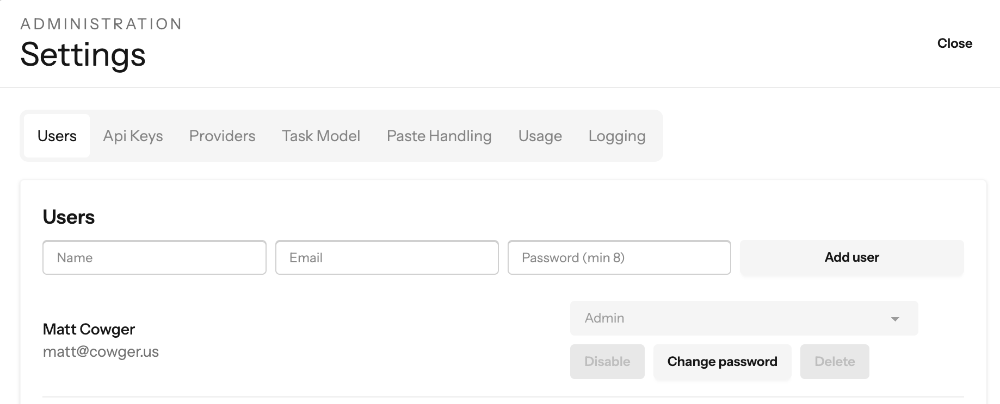
</p>
<p align="center">
  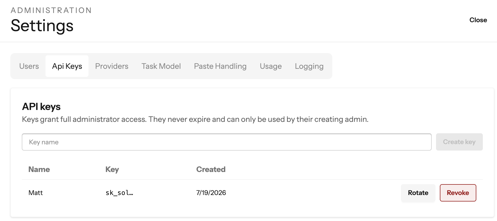
</p>
</details>

<details>
<summary><strong>Providers, models, and context</strong></summary>
<br>
<p align="center">
  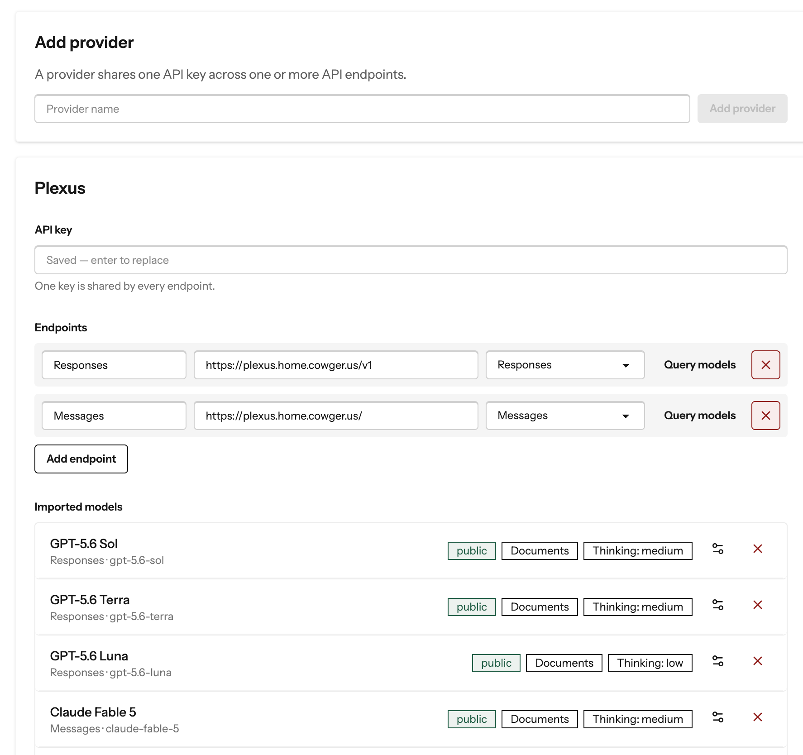
</p>
<p align="center">
  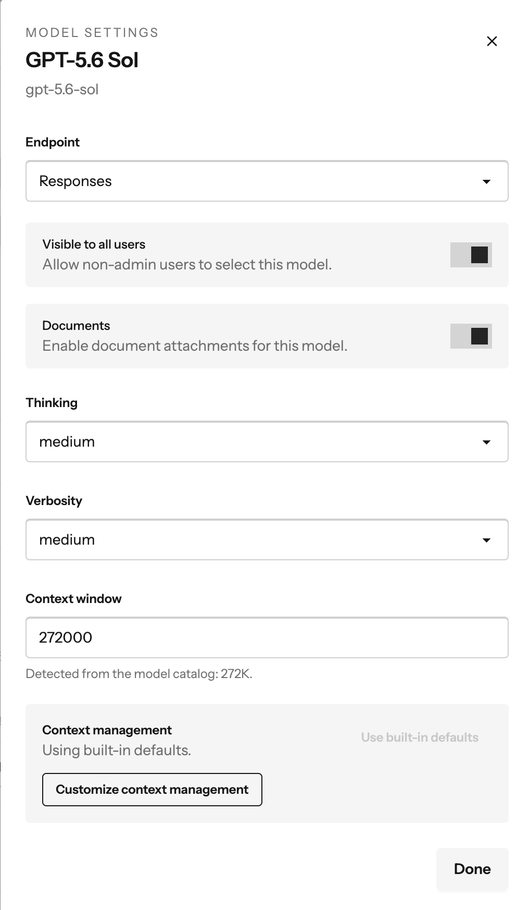
  &nbsp;
  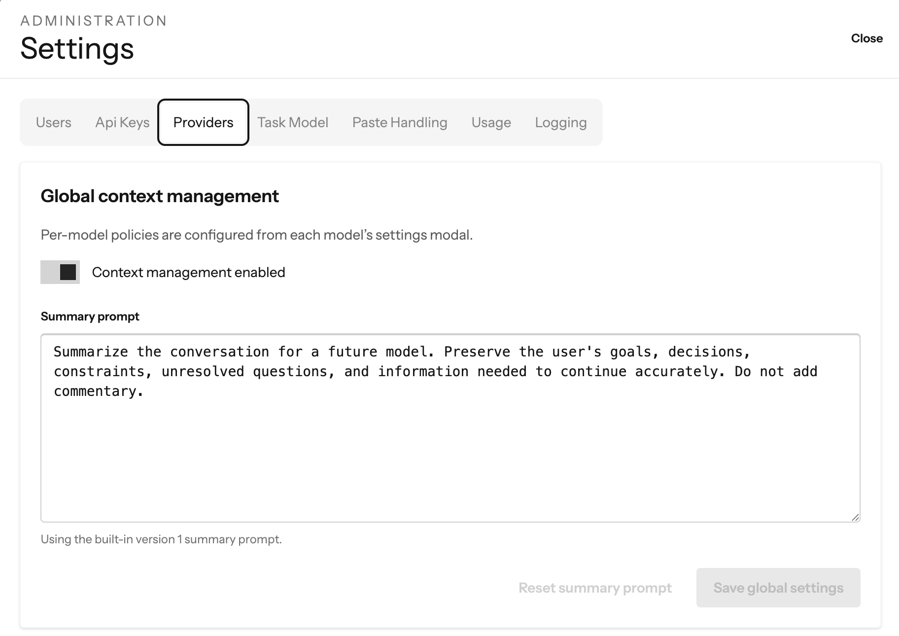
</p>
</details>

<details>
<summary><strong>Operations and defaults</strong></summary>
<br>
<p align="center">
  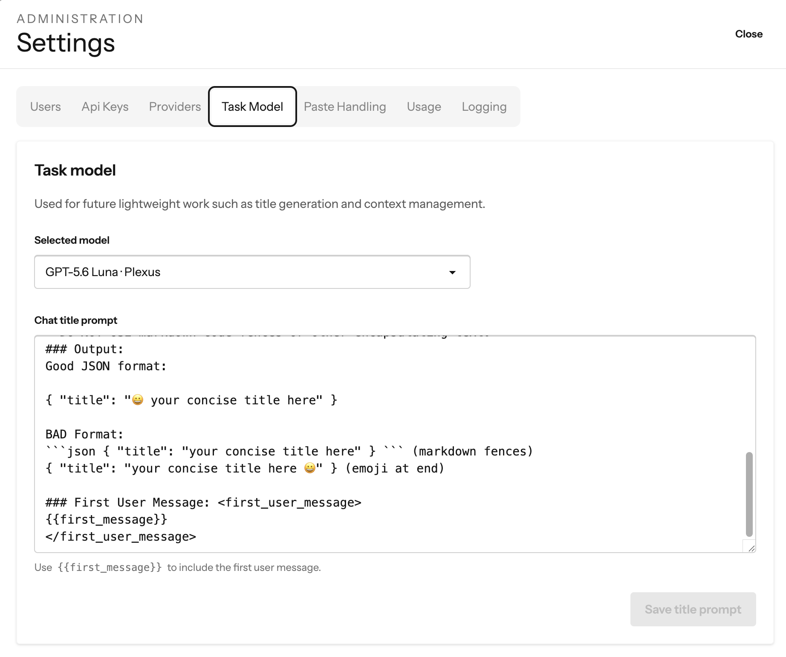
</p>
<p align="center">
  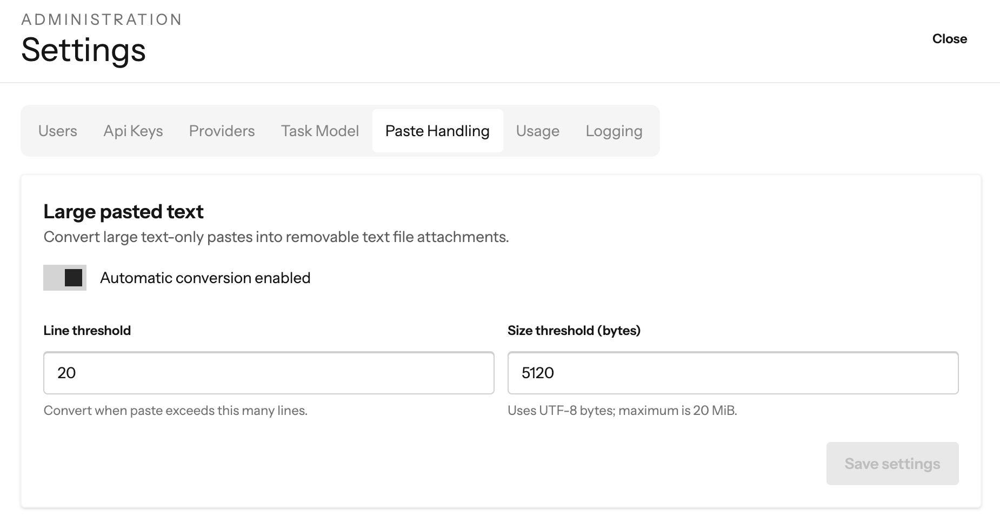
  &nbsp;
  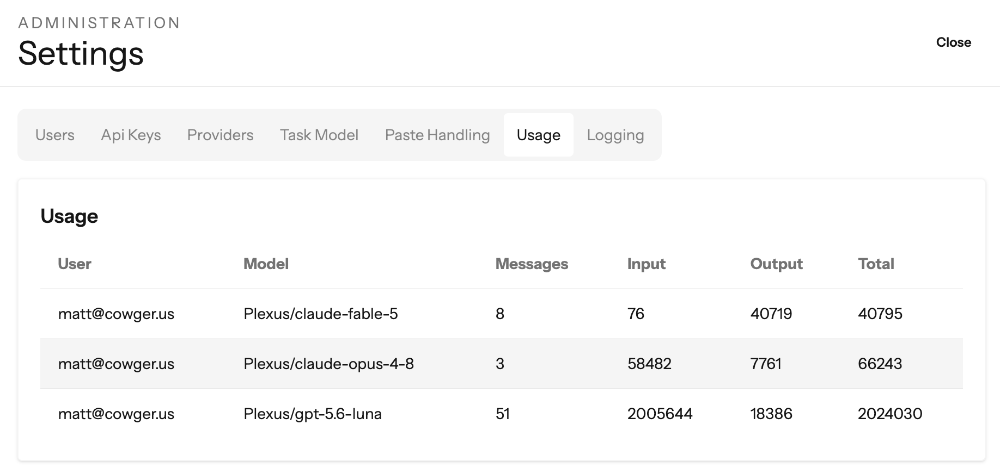
</p>
</details>

## Configuration

| Variable | Purpose |
| --- | --- |
| `BETTER_AUTH_SECRET` | Required signing secret; use 32+ random characters |
| `GOOGLE_CLIENT_ID` / `GOOGLE_CLIENT_SECRET` | Optional Google OAuth credentials |
| `CLOUDFLARE_RADAR_API_TOKEN` | Optional Cloudflare Radar token for source categories |
| `DATABASE_PATH` | SQLite file path |
| `SOLAR_ATTACHMENTS_DIR` | Local attachment storage directory |
| `PORT` / `PASEO_PORT` | Listening port / managed dev-server override |
| `SOLAR_MOCK_LLM` | Enable the local zero-cost mock provider |

Provider keys, enabled models, presets, context policies, and MCP servers are
managed from the authenticated UI. See `.env.example` for the complete runtime
surface.

Source-category badges use a bundled registry of 300+ news domains derived from
[Wikidata's CC0](https://www.wikidata.org/wiki/Wikidata:Data_access) news-media
and newspaper records. Unknown domains are resolved through the optional
Cloudflare Radar fallback and persisted locally.

Google OAuth is enabled when both Google credentials are set. Configure the
Google OAuth redirect URI as `${BETTER_AUTH_URL}/api/auth/callback/google`.
Google sign-ins use the verified Google email address to identify and link the
account; accounts with different email addresses are not linked.

## Status

Solar is experimental. The streamed chat path, multi-provider model selection,
presets, reasoning controls, citations, attachments, context management, admin
surface, PWA shell, and remote MCP integration are present; APIs and UI details
may still evolve.

The project deliberately does **not** include RAG/vector search, voice, image
generation, channels, enterprise SSO, or horizontal multi-node scaling.

## Development

```sh
bun run typecheck
bun run test
bun run build
```

The repository is a Bun workspaces monorepo with `apps/server`, `apps/web`, and
`packages/shared`. The server owns migrations for application tables; Better
Auth owns its auth migrations.

### Playwright E2E setup (one-time)

On a new Linux machine, install Playwright's host packages once, then install
browser binaries as the regular user (do not run the second command with `sudo`,
or the browsers land in root's cache):

```sh
sudo node ./node_modules/@playwright/test/cli.js install-deps chromium firefox webkit
bun run test:e2e:install
```

Run E2E tests with `bun run test:e2e` (Chromium) or `bun run test:e2e:all`
(Chromium, Firefox, WebKit).

### Deployment note

For real deployments prefer a supervisor (systemd `Restart=always` or PM2) —
`bun run` itself does not restart on crash or rotate logs.
