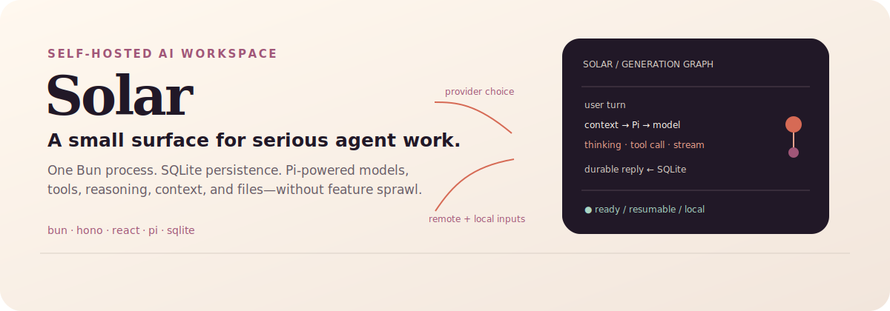
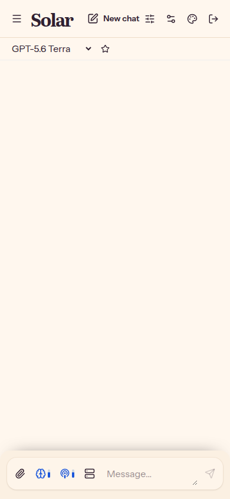
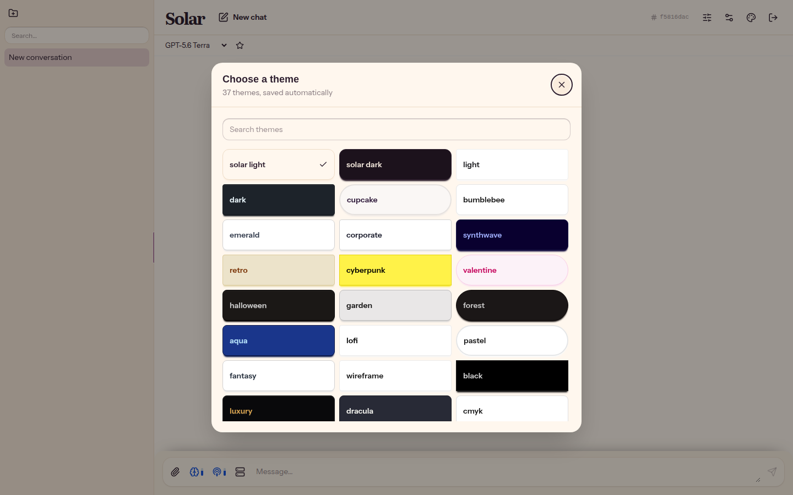

<p align="center">
  
</p>

<p align="center">
  <strong>Self-hosted AI chat for teams who prefer a coherent tool over a feature maze.</strong><br>
  One Bun process · SQLite · local attachments · resumable streaming
</p>

<p align="center">
  <a href="#quick-start">Quick start</a> ·
  <a href="#what-you-get">Capabilities</a> ·
  <a href="#how-it-works">How it works</a> ·
  <a href="#status">Status</a>
</p>

## See the surface

Solar keeps the working set visible without making the interface feel like an
admin console: conversations on the left, model selection above the thread,
and controls for attachments, reasoning, verbosity, and MCP tools in the
composer.

<p align="center">
  
</p>

<p align="center">
  
  &nbsp;
  
  &nbsp;
  
</p>

<p align="center">
  
  &nbsp;&nbsp;
  
</p>

## What you get

### A capable agent surface, kept small

- **Pi under the hood.** `pi-agent-core` drives the agent loop and `pi-ai`
  provides a unified path across configured providers and model APIs. Switch
  models per conversation instead of rebuilding the workspace around one vendor.
  - This also means excellent support for provider and API specific behaviors.  OpenAI cache keys, Anthropic breakpoints, Deepseek reasoning replay, etc all work out of the box.
- **Live controls.** Choose reasoning effort, expose provider reasoning output,
  and set answer verbosity when the selected model supports them. Thinking,
  tool calls, Markdown, code, and LaTeX stream into the thread as first-class
  parts.
- **Remote MCP tools.** Connect Streamable HTTP MCP servers, discover tools,
  prompts, and resources, then enable them globally, per user, or per
  conversation. Tool calls show their remote server and execution state.
- **Context that manages itself.** Solar assembles a bounded context from stable
  instructions, the first request, a rolling structured summary, and the most
  useful recent turns. Background compaction reduces old reasoning and bulky
  tool transactions before summarizing older history.
- **Files without a heavy RAG pipeline.** Images become provider-native vision
  inputs. Plain text and supported Office/PDF documents are extracted or passed
  through according to model capability—no embeddings or vector database
  required.
- **Persistent by default.** Conversations, native message parts, tool steps,
  summaries, usage, and attachments live in one SQLite database plus a local
  data directory. A dropped browser connection does not cancel generation;
  reload can bring it right back.
- **Full theme and device support.** Themes are saved automatically, with 37
  available choices including Solar Light and Solar Dark. The responsive shell
  turns the sidebar into a drawer on narrow screens, and the web manifest ships
  standalone PWA metadata and maskable icons.
- **Lightweight deployment.** A single Bun/Hono process serves the API, SSE
  stream, and React build. No separate frontend host, queue, vector store, or
  services bundle is required.

## How it works

```text
browser
  │  typed tRPC + SSE UI Message Stream
  ▼
one Bun process ── Hono / tRPC / generation manager
  │       │             │
  │       │             └── pi-agent-core + pi-ai
  │       └──────────────── models, reasoning, MCP tools
  ├── React + assistant-ui
  ├── SQLite (auth, chats, native parts, context, usage)
  └── Mirage local disk (images, text, documents)
```

The generation task is decoupled from the HTTP request. It buffers deltas,
persists the final native assistant message, and lets SSE subscribers reconnect
with `Last-Event-ID`. Explicit **Stop** is the cancellation boundary.

## Quick start

### Docker Compose

```sh
cp .env.example .env
# Set BETTER_AUTH_SECRET to a strong value of at least 32 characters.
docker compose up --build
```

Open <http://localhost:3000>. Persistent database and attachment data live in
`./data`.

The first account registered on a fresh deployment becomes the admin. In local
development, the seeded convenience account is `admin@solar.local` with
password `password`.

### Bun development

```sh
bun install
bun run solar dev start
```

The managed server chooses a stable worktree-specific port in the `3000–3999`
range. Set `PASEO_PORT` to override it. Use `SOLAR_MOCK_LLM=1` to exercise the
full UI with a zero-cost local generator. On an empty development database, it
prints the seeded admin login and generated Development API key, which persists
with the database.

### Bun package (after publishing)

```sh
bunx @mcowger/solar
```

SQLite and attachments are created relative to the current directory by default.

## Configuration

| Variable | Purpose |
| --- | --- |
| `BETTER_AUTH_SECRET` | Required signing secret; use 32+ random characters |
| `GOOGLE_CLIENT_ID` / `GOOGLE_CLIENT_SECRET` | Optional Google OAuth credentials |
| `DATABASE_PATH` | SQLite file path |
| `SOLAR_ATTACHMENTS_DIR` | Local attachment storage directory |
| `PORT` / `PASEO_PORT` | Listening port / managed dev-server override |
| `SOLAR_MOCK_LLM` | Enable the local zero-cost mock provider |

Provider keys, enabled models, presets, context policies, and MCP servers are
managed from the authenticated UI. See `.env.example` for the complete runtime
surface.

Google OAuth is enabled when both Google credentials are set. Configure the
Google OAuth redirect URI as `${BETTER_AUTH_URL}/api/auth/callback/google`.
Google sign-ins use the verified Google email address to identify and link the
account; accounts with different email addresses are not linked.

## Status

Solar is an experimental build. The core streamed chat path, multi-provider
model selection, presets, reasoning controls, attachments, context management,
admin surface, PWA shell, and remote MCP integration are present; APIs and UI
details may still evolve.

The project deliberately does **not** include RAG/vector search, voice, image
generation, channels, enterprise SSO, or horizontal multi-node scaling.

## Development

```sh
bun run typecheck
bun run test
bun run build
```

The repository is a Bun workspaces monorepo with `apps/server`, `apps/web`, and
`packages/shared`. The server owns migrations for application tables; Better
Auth owns its auth migrations.

### Playwright E2E setup (one-time)

On a new Linux machine, install Playwright's host packages once, then install
browser binaries as the regular user (do not run the second command with
`sudo`, or the browsers land in root's cache):

```sh
sudo node ./node_modules/@playwright/test/cli.js install-deps chromium firefox webkit
bun run test:e2e:install
```

Run E2E tests with `bun run test:e2e` (Chromium) or `bun run test:e2e:all`
(Chromium, Firefox, WebKit).

### Deployment note

For real deployments prefer a supervisor (systemd `Restart=always` or PM2) —
`bun run` itself does not restart on crash or rotate logs.
