<p align="center">
  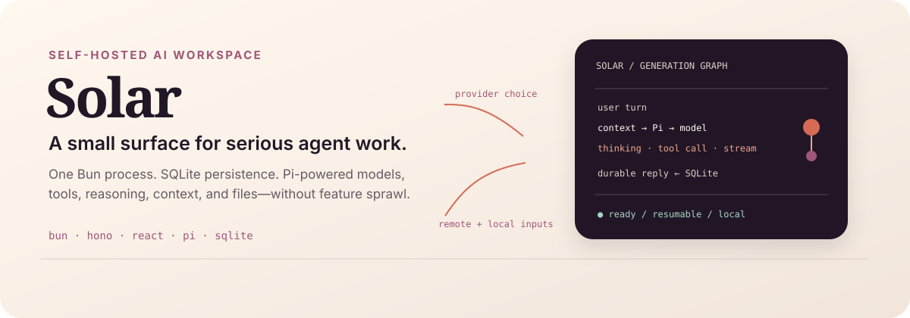
</p>

<p align="center">
  <strong>Self-hosted AI chat for teams who prefer a coherent tool over a feature maze.</strong><br>
  One Bun process · SQLite · pi JSONL sessions · local attachments · resumable streaming
</p>

<p align="center">
  <a href="#see-it-work">See it work</a> ·
  <a href="#what-you-get">Capabilities</a> ·
  <a href="#quick-start">Quick start</a> ·
  <a href="#administration">Administration</a> ·
  <a href="#status">Status</a>
</p>

## See it work

Solar keeps research, source evidence, model choice, tools, and the next prompt
in one working surface. This example combines web and local-tool calls while
keeping its source trail attached to the reply.

<p align="center">
  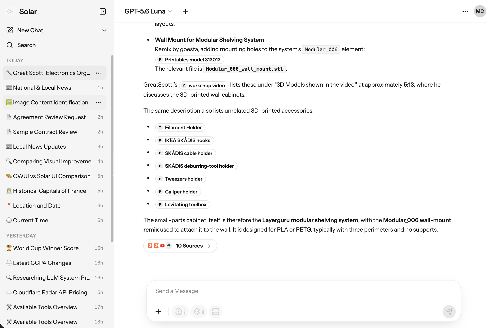
</p>

<p align="center">
  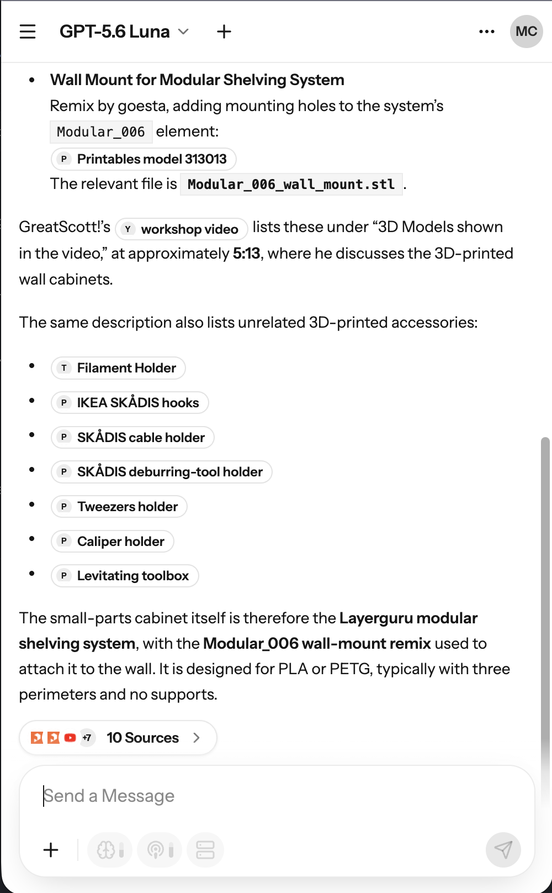
  &nbsp;&nbsp;
  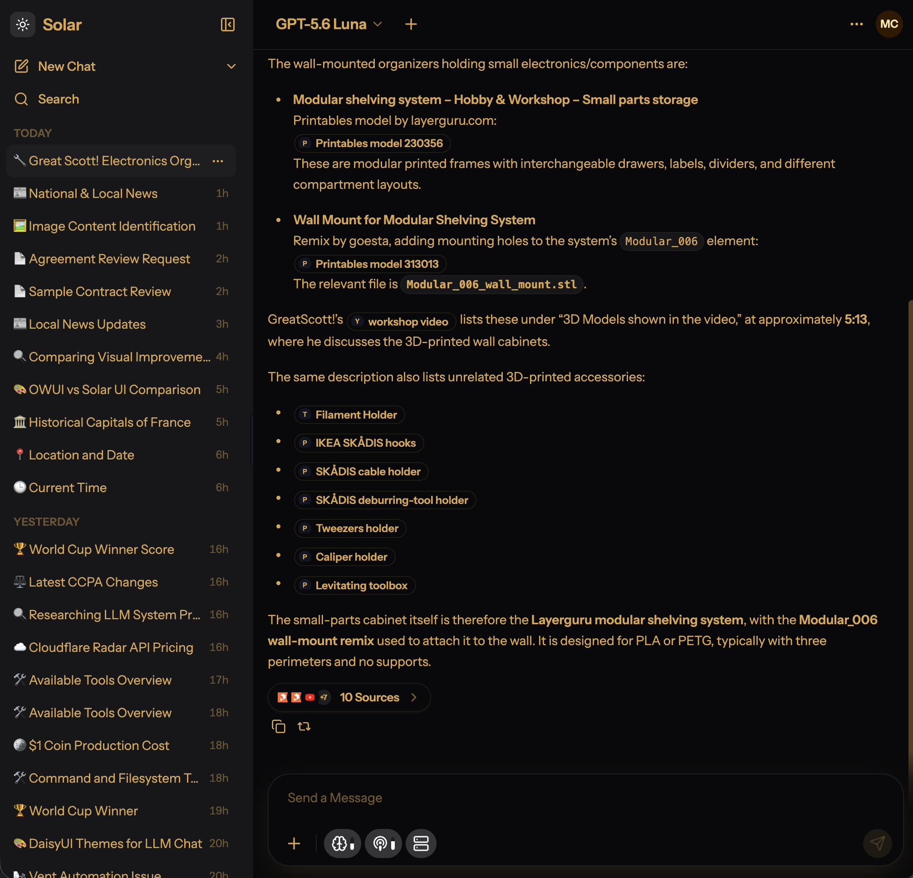
</p>

### Evidence stays with the answer

Source chips work inline and a compact source list collects the material behind
the response.

<p align="center">
  
</p>

### Set up the conversation, not just the prompt

Start from a reusable preset, choose a configured model, set answer detail, and
select the MCP servers that may run. The conversation menu makes its current
context window, compaction progress, and cost inspectable.

<p align="center">
  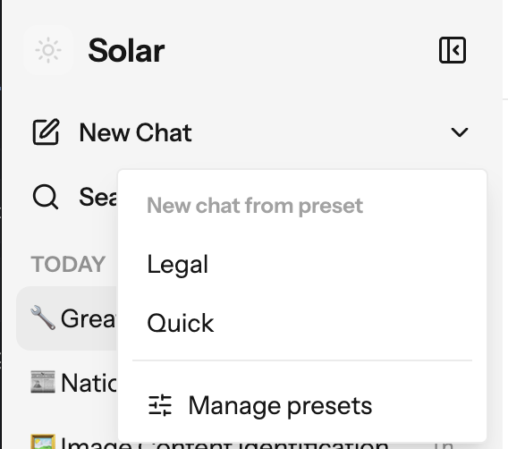
  &nbsp;
  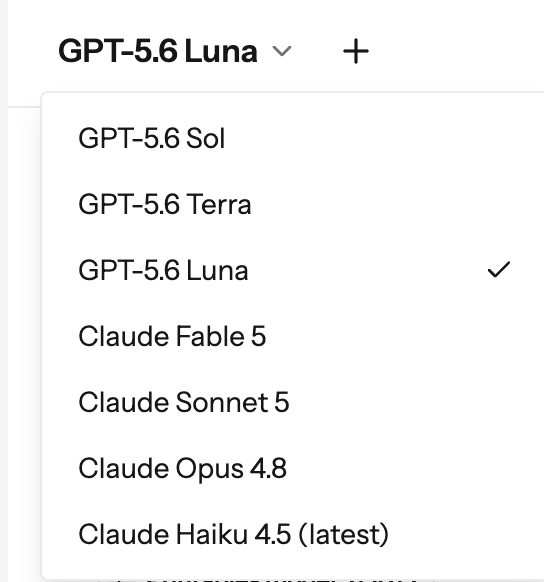
  &nbsp;
  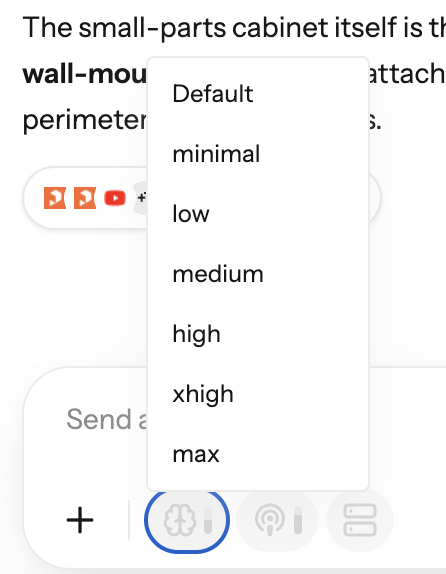
</p>

<p align="center">
  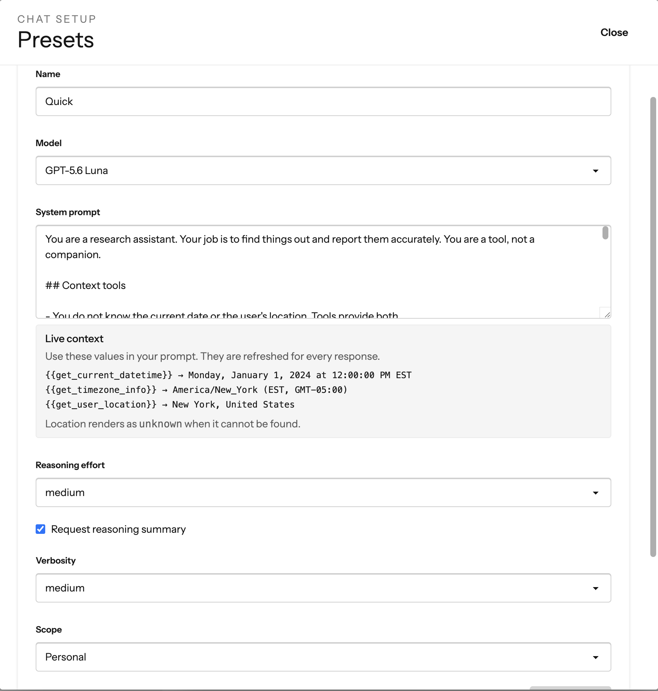
</p>

<p align="center">
  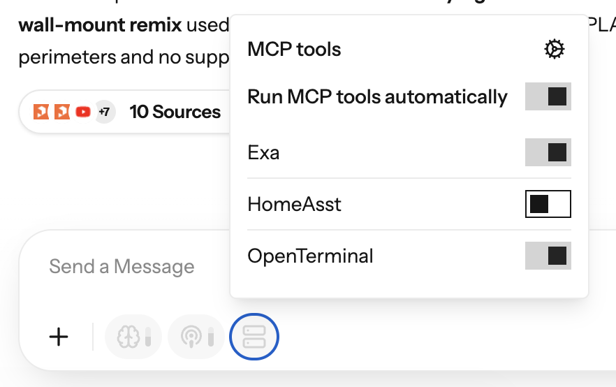
  &nbsp;
  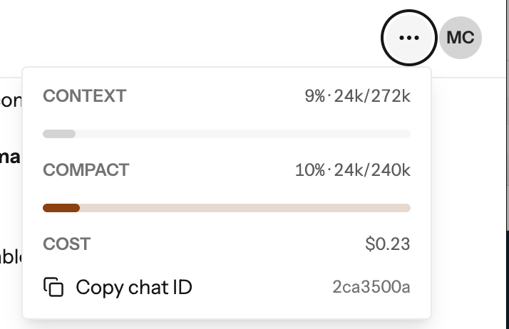
</p>

### Give the agent real work

Files become native model inputs where supported. Tool activity streams as part
of the answer, including built-in context tools and remote MCP servers; the
finished answer can cite the sources it used.

<p align="center">
  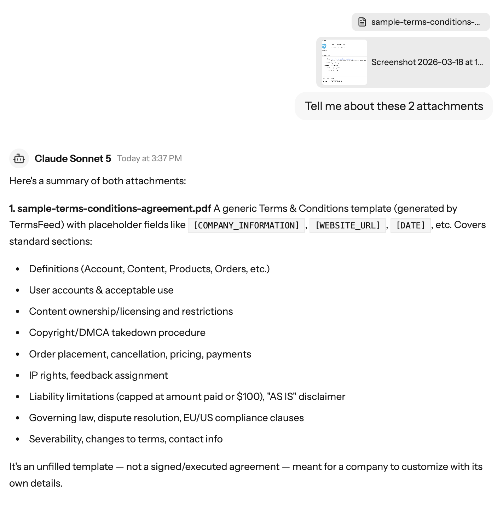
</p>

<p align="center">
  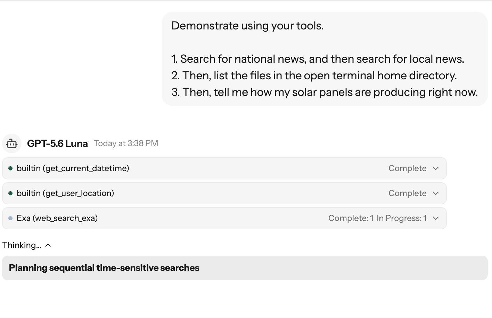
  &nbsp;
  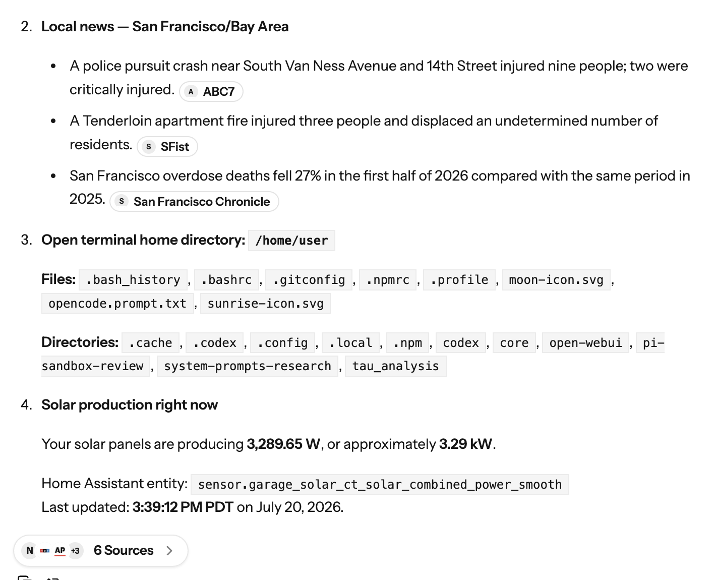
</p>

## What you get

- **Pi-powered, model-flexible chat.** `pi-coding-agent` owns the agent loop and
  session state, while `pi-ai` provides a unified path across configured
  providers and model APIs. Switch models per conversation without rebuilding
  the workspace around one vendor.
- **First-class streamed parts.** Thinking, tool calls, Markdown, code, LaTeX,
  citations, and source lists arrive in the thread as they are produced.
- **Remote MCP tools.** Connect Streamable HTTP MCP servers, discover tools,
  prompts, and resources, and enable them globally, per user, or per
  conversation.
- **Context that manages itself.** Solar builds a bounded context from stable
  instructions, the first request, a structured rolling summary, and useful
  recent turns. Background compaction reduces old reasoning and bulky tool
  transactions before older history is summarized.
- **Files without a heavy RAG pipeline.** Images become provider-native vision
  inputs. Plain text and supported Office/PDF documents are extracted or passed
  through according to model capability—no embeddings or vector database
  required.
- **Persistent by default.** Conversation ownership, settings, and attachments
  live in SQLite and the local data directory. Canonical conversation messages
  and pi session state live as JSONL under `SOLAR_PI_AGENT_DIR`. A dropped
  browser connection does not cancel generation; reload can bring it back.
- **Responsive and themed.** The sidebar becomes a drawer on narrow screens;
  themes persist automatically, with Solar Light and Solar Dark among the
  choices.
- **Lightweight deployment.** A single Bun/Hono process serves the API, SSE
  stream, and React build. No separate frontend host, queue, vector store, or
  services bundle is required.

## How it works

```text
browser
  │  typed tRPC + SSE UI Message Stream
  ▼
one Bun process ── Hono / tRPC / pi RPC bridge
  │       │             │
  │       │             └── pi --mode rpc child (live generation)
  │       └──────────────── models, reasoning, MCP tools
  ├── React + assistant-ui
  ├── SQLite (auth, ownership, settings, attachments)
  └── Mirage local disk (images, text, documents)
       │
       └── pi JSONL sessions under SOLAR_PI_AGENT_DIR
```

The generation task is decoupled from the HTTP request. The pi child persists
the canonical session while the server bridge buffers deltas and lets SSE
subscribers reconnect with `Last-Event-ID`. Explicit **Stop** is the
cancellation boundary.

## Quick start

### Docker Compose

```sh
cp .env.example .env
# Set BETTER_AUTH_SECRET to a strong value of at least 32 characters.
docker compose up --build
```

Open <http://localhost:3000>. The `./data` directory contains the persistent
database, attachment data, and pi agent/session state.

The first account registered on a fresh deployment becomes the admin. In local
development, the seeded convenience account is `admin@solar.local` with
password `password`.

### Bun development

```sh
bun install
SOLAR_MOCK_LLM=1 bun run dev
```

The managed server uses `scripts/port-allocator.sh` to choose a stable worktree-specific
port in the `3000–3999` range. Set `PORT` to override it. Use `SOLAR_MOCK_LLM=1` to exercise the
full UI with a zero-cost local generator. On an empty development database, it
prints the seeded admin login and generated Development API key, which persists
with the database.

To expose the local server through FRP, install `frpc` and set
`FRPC_SERVER_ADDR` and `FRPC_AUTH_TOKEN`. Solar starts the tunnel after `/healthz`
is ready. `FRPC_SERVER_PORT` defaults to `7000`; `FRPC_SUBDOMAIN_HOST` optionally
adds the public hostname to the logged URL.

### Bun package (after publishing)

```sh
bunx @mcowger/solar
```

SQLite, attachments, and pi agent/session state are created relative to the
current directory by default.

## Administration

Solar puts the operational surface in the product: users and administrator API
keys; provider endpoints and imported models; model capabilities and context
policy; task-model and large-paste settings; and aggregated token usage.

<details>
<summary><strong>Users and API keys</strong></summary>
<br>
<p align="center">
  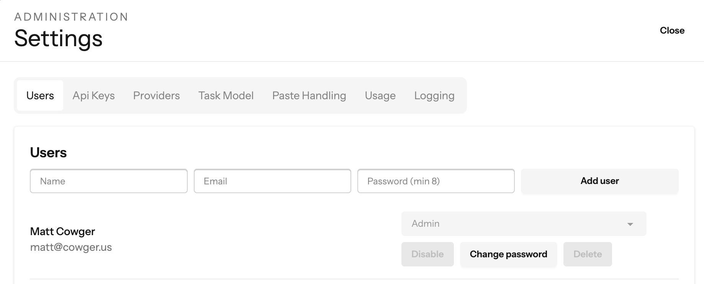
</p>
<p align="center">
  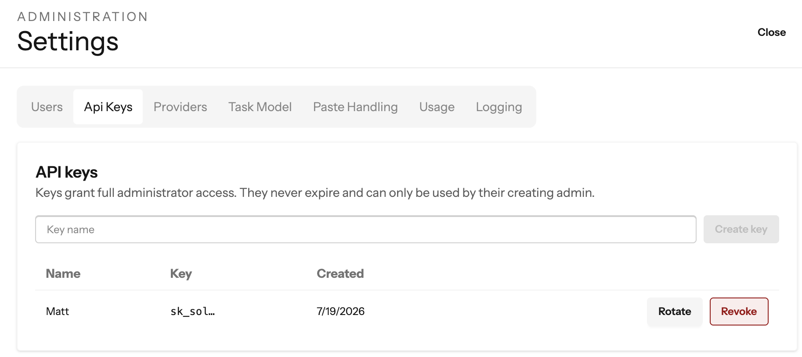
</p>
</details>

<details>
<summary><strong>Providers, models, and context</strong></summary>
<br>
<p align="center">
  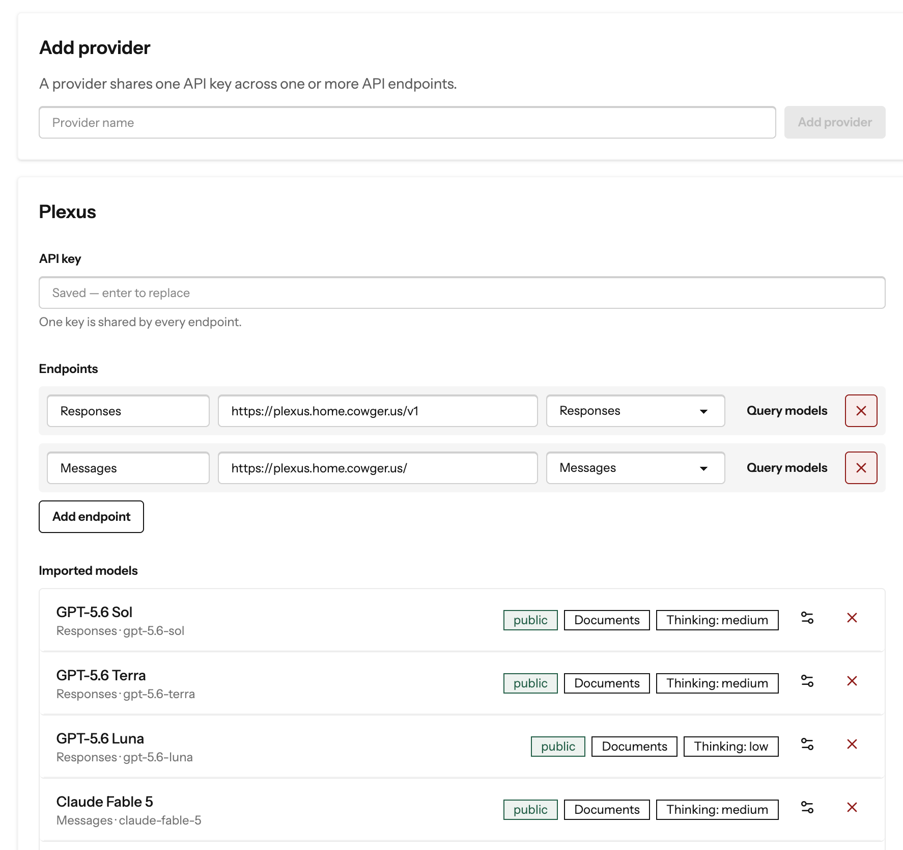
</p>
<p align="center">
  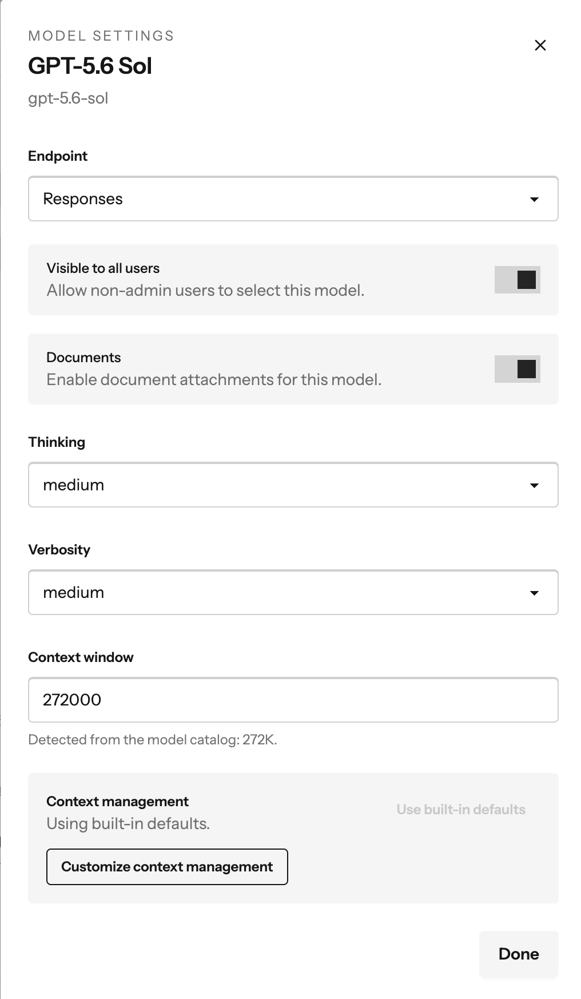
  &nbsp;
  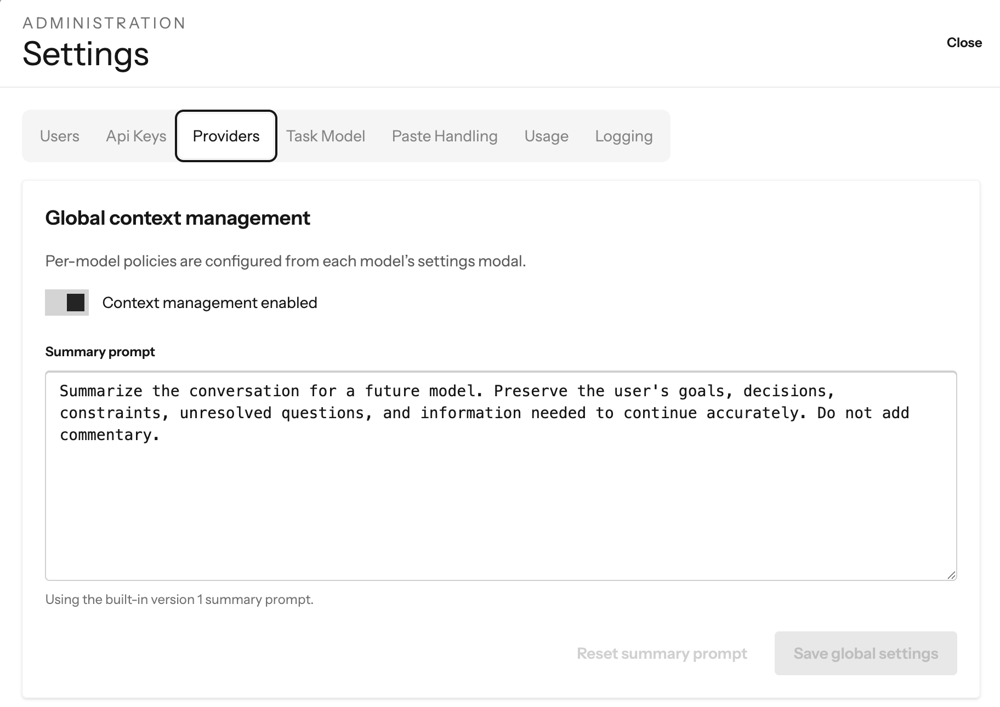
</p>
</details>

<details>
<summary><strong>Operations and defaults</strong></summary>
<br>
<p align="center">
  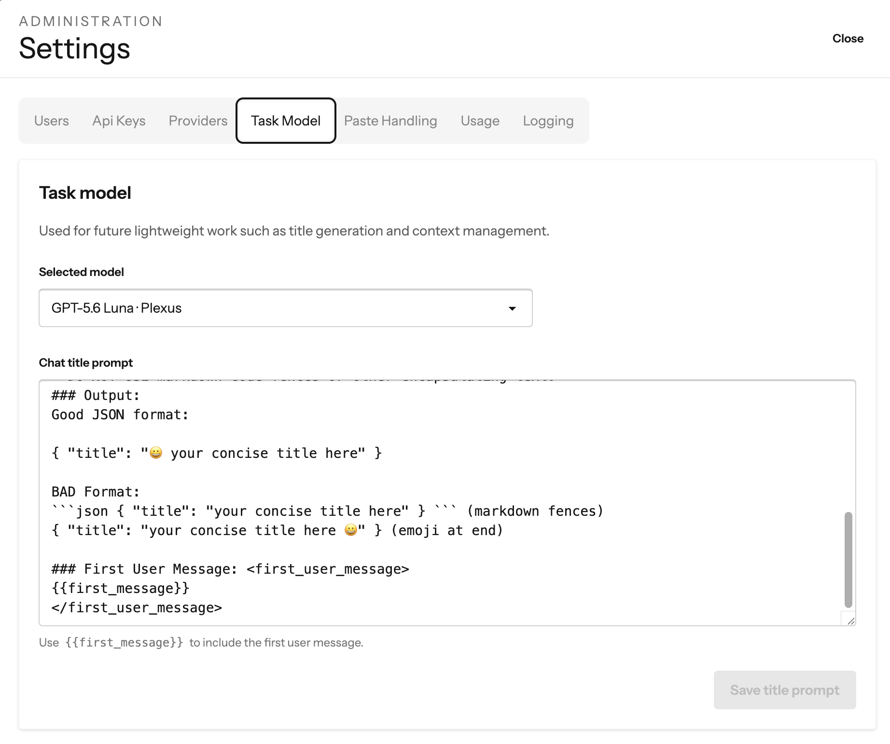
</p>
<p align="center">
  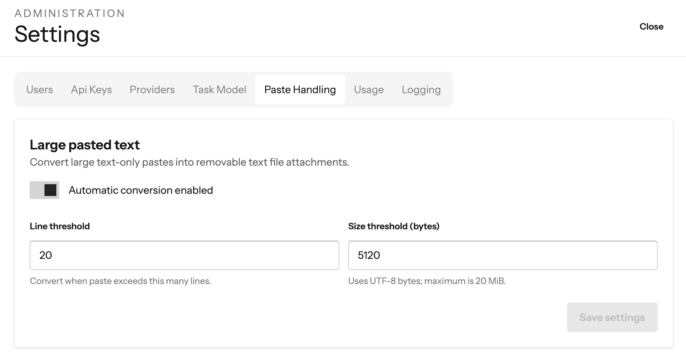
  &nbsp;
  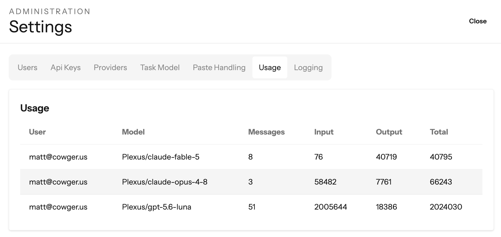
</p>
</details>

## Configuration

| Variable | Purpose |
| --- | --- |
| `BETTER_AUTH_SECRET` | Required signing secret; use 32+ random characters |
| `BETTER_AUTH_URL` | Public base URL; every OAuth redirect URI derives from it |
| `GOOGLE_CLIENT_ID` / `GOOGLE_CLIENT_SECRET` | Optional Google OAuth credentials |
| `OIDC_ISSUER` / `OIDC_CLIENT_ID` / `OIDC_CLIENT_SECRET` | Optional OpenID Connect provider; all three enable it |
| `OIDC_DISPLAY_NAME` / `OIDC_SCOPES` / `OIDC_DISABLE_SIGNUP` | Sign-in button label, requested scopes, and whether first sign-in may provision |
| `OIDC_ADMIN_CLAIM` / `OIDC_ADMIN_VALUE` | Optional group claim and value granting the admin role |
| `CLOUDFLARE_RADAR_API_TOKEN` | Optional Cloudflare Radar token for source categories |
| `SOLAR_AIRGAP_MODE` / `AIRGAP_MODE` | Set to `1`/`true`/`yes`/`on` to block outbound network calls |
| `DATABASE_PATH` | SQLite file path |
| `SOLAR_ATTACHMENTS_DIR` | Local attachment storage directory |
| `SOLAR_PI_AGENT_DIR` | Persistent pi agent state and canonical conversation sessions |
| `SOLAR_PI_CWD_ROOT` | Scratch directories used as pi process working directories |
| `SOLAR_PI_MAX_PROCESSES` | Maximum concurrently live pi RPC children (default `8`) |
| `SOLAR_MCP_TOOL_TIMEOUT_MS` | How long one MCP tool call may run (default `60000`); keep it below `SOLAR_PI_STALL_TIMEOUT_MS` |
| `PORT` | Listening port / managed dev-server override |
| `FRPC_SERVER_ADDR` / `FRPC_AUTH_TOKEN` | Optional FRP server address and token |
| `FRPC_SERVER_PORT` | Optional FRP control port; defaults to `7000` |
| `FRPC_SUBDOMAIN_HOST` | Optional FRP public hostname suffix |
| `SOLAR_MOCK_LLM` | Enable the local zero-cost mock provider |

Provider keys, enabled models, presets, context policies, and MCP servers are
managed from the authenticated UI. See `.env.example` for the complete runtime
surface.

When `SOLAR_AIRGAP_MODE` (or `AIRGAP_MODE`) is active (`1`, `true`, `yes`, or `on`):
- **Geocoding** is disabled (browser GPS coordinates are kept, but no reverse-geocoding calls are made to OpenStreetMap Nominatim).
- **Domain classification** uses local DB cache and bundled registries only, skipping Cloudflare Radar API lookups.
- **Google OAuth** is disabled and hidden from sign-in options.
- **OIDC sign-in stays enabled**: a self-hosted identity provider is the operator's own service, not a third-party call.
- **Citation favicons** are replaced with inline SVG placeholders, suppressing remote favicon fetches in the browser.

Source-category badges use a bundled registry of 300+ news domains derived from
[Wikidata's CC0](https://www.wikidata.org/wiki/Wikidata:Data_access) news-media
and newspaper records. Unknown domains are resolved through the optional
Cloudflare Radar fallback and persisted locally.

Google OAuth is enabled when both Google credentials are set. Configure the
Google OAuth redirect URI as `${BETTER_AUTH_URL}/api/auth/callback/google`.
Google sign-ins use the verified Google email address to identify and link the
account; accounts with different email addresses are not linked.

### OIDC / SSO

Solar can sign users in through one self-hosted OpenID Connect provider. Set
`OIDC_ISSUER`, `OIDC_CLIENT_ID`, and `OIDC_CLIENT_SECRET` to enable it; the
sign-in page then shows a "Continue with `OIDC_DISPLAY_NAME`" button. Endpoints
are read from `${OIDC_ISSUER}/.well-known/openid-configuration`, and the flow
uses PKCE. The issuer and discovered userinfo endpoint must use HTTPS; cleartext
HTTP is accepted only for `localhost`, `127.0.0.1`, and `[::1]` development
endpoints.

Register this redirect URI at the provider:

```
${BETTER_AUTH_URL}/api/auth/callback/oidc
```

Issuer values differ by product:

| Provider | `OIDC_ISSUER` | Group claim |
| --- | --- | --- |
| Authentik | `https://auth.example.com/application/o/<slug>/` | `groups` |
| Keycloak | `https://kc.example.com/realms/<realm>` | `realm_access.roles` |
| Zitadel | `https://<instance>.zitadel.cloud` | `urn:zitadel:iam:org:project:roles` |
| Authelia | `https://auth.example.com` | `groups` |

A first sign-in creates the Solar account, subject to `AUTH_ALLOWED_DOMAINS`.
Set `OIDC_DISABLE_SIGNUP=1` to require that an admin create the user first,
matching Google's behaviour. An IdP identity is linked to an existing account
when the email addresses match exactly; differing addresses are never linked.
The first account on a fresh deployment becomes the admin however it signs in.

Setting both `OIDC_ADMIN_CLAIM` and `OIDC_ADMIN_VALUE` maps a group to the admin
role, re-checked on every OIDC sign-in, so removing someone from the group at
the provider demotes them (and revokes their API keys) on their next sign-in.
Solar refuses to demote the last remaining admin. The claim must reach Solar in
the ID token or the userinfo response: on Keycloak add a mapper with "Add to ID
token" or "Add to userinfo" enabled, and request whichever scope carries it via
`OIDC_SCOPES`. Roles stay manually managed in Settings when these are unset.

Sign-ins are PKCE-protected, and when the provider's discovery document
advertises a JWKS endpoint the ID token's signature and nonce are verified too.

## Migrating legacy chat history

Pi session JSONL is the canonical conversation history. Existing chat-v2 rows
can be imported ahead of first use with the optional bulk pre-warm script:

```sh
bun run scripts/import-chat-v2-to-pi.ts --dry-run
bun run scripts/import-chat-v2-to-pi.ts
```

Run it with the same `DATABASE_PATH` and `SOLAR_PI_AGENT_DIR` as the server.
Back up SQLite, attachments, and the complete pi agent directory before an
import; the normal chat path also imports legacy conversations lazily when they
are first opened or continued.

## Deployment

```sh
bun run deploy:staging
bun run deploy:production
```

Both commands use `scripts/deploy.ts`. Target-specific overrides use
`SOLAR_STAGING_*` or `SOLAR_PRODUCTION_*` environment variables. Keep the
deployment's `/data` volume intact across upgrades: it contains SQLite,
attachments, and `/data/pi-agent`, including canonical session JSONL.

## Status

Solar is experimental. The streamed chat path, multi-provider model selection,
presets, reasoning controls, citations, attachments, context management, admin
surface, PWA shell, and remote MCP integration are present; APIs and UI details
may still evolve.

The project deliberately does **not** include RAG/vector search, voice, image
generation, channels, multi-tenant enterprise SSO (SAML, per-organization
providers), or horizontal multi-node scaling.

## Development

```sh
bun run typecheck
bun run test
bun run build
```

The repository is a Bun workspaces monorepo with `apps/server`, `apps/web`, and
`packages/shared`. The server owns migrations for application tables; Better
Auth owns its auth migrations.

### Playwright E2E setup (one-time)

On a new Linux machine, install Playwright's host packages once, then install
browser binaries as the regular user (do not run the second command with `sudo`,
or the browsers land in root's cache):

```sh
sudo node ./node_modules/@playwright/test/cli.js install-deps chromium firefox webkit
bun run test:e2e:install
```

Run E2E tests with `bun run test:e2e` (Chromium) or `bun run test:e2e:all`
(Chromium, Firefox, WebKit).

### Process supervision note

For real deployments prefer a supervisor (systemd `Restart=always` or PM2) —
`bun run` itself does not restart on crash or rotate logs.
